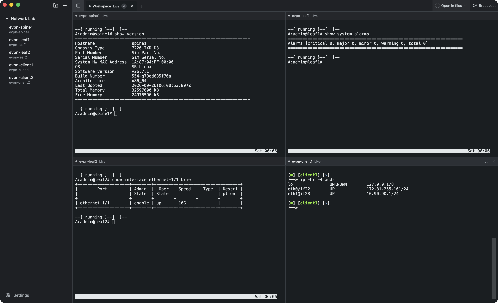

# SSHBrowse

SSHBrowse is a cross-platform desktop app for managing SSH, SFTP, and local terminal sessions. It is built for people looking for a modern alternative to SecureCRT, MobaXterm, and other session managers.

Save and organize connections, open sessions in tabs or tiles, and send commands or live input to multiple terminals at once. SSHBrowse runs on macOS, Windows, and Linux.

SSHBrowse is currently in beta.

[Releases](https://github.com/osmocomet/sshbrowse/releases) · [Report a bug](https://github.com/osmocomet/sshbrowse/issues/new/choose) · [Contribute](CONTRIBUTING.md)

## Built on OpenSSH

The actual SSH and SFTP connections, authentication, host-key verification, and SSH configuration are handled by your system's `ssh` and `sftp` clients.

SSHBrowse does not implement the SSH protocol itself, proxy SSH traffic through another service, or store your passwords or private keys.

## Highlights

- Save and organize SSH connections in folders
- Import aliases from your OpenSSH config
- Choose a saved connection as a jump host, or enter a raw ProxyJump route
- Open SSH, SFTP, and local terminal sessions
- Work with tabs or tiled terminals
- Send commands or live input to multiple sessions

## Platforms

SSHBrowse provides native packages for macOS, Windows, and Linux.

| Platform | Package | Notes |
| --- | --- | --- |
| macOS 15+ (Apple silicon and Intel) | Universal DMG | Tested on Apple silicon. Ad-hoc signed; Gatekeeper may require manual approval because the app is not notarized. |
| Linux x86-64 | DEB or RPM | Tested on Fedora 44 and Ubuntu 26.04 with GNOME/Wayland. Other distributions need GTK4 and WebKitGTK 6.0. Packages are unsigned. |
| Windows 11 x64 | Per-user installer | Requires the Windows OpenSSH Client. The installer handles WebView2 when missing (Internet required). The installer is unsigned; SmartScreen may warn. |

For release downloads, check the architecture and compare the SHA-256 hash with `SHA256SUMS`.

## Get started

Download the latest package from [Releases](https://github.com/osmocomet/sshbrowse/releases).

After launching SSHBrowse, you can:

- Create a saved connection
- Import aliases with **Shell > Import from SSH Config…**
- Enter `user@host:port` directly in the new-tab picker

## Help and contributing

For connection problems, try the same destination with system OpenSSH (`ssh alias` or `ssh user@host`). Use the [bug report form](https://github.com/osmocomet/sshbrowse/issues/new/choose) for bugs and [SECURITY.md](SECURITY.md) for private vulnerability reports. Redact credentials and private host details.

Bug reports, suggestions, and focused pull requests are welcome. See [CONTRIBUTING.md](CONTRIBUTING.md) for setup, contribution terms, and guidance on discussing larger changes first.

## Licensing

SSHBrowse is free for personal, non-commercial use. Professional, workplace, or commercial use requires a paid license.

The source code is publicly available for inspection and private personal modification. Independent redistribution, including modified versions, requires authorization; GitHub's viewing and forking rights still apply.

See [NOTICE](NOTICE) for SSHBrowse's terms and [THIRD_PARTY_NOTICES.txt](docs/legal/THIRD_PARTY_NOTICES.txt) for third-party licenses. Run `sshbrowse --licenses` to print both.
